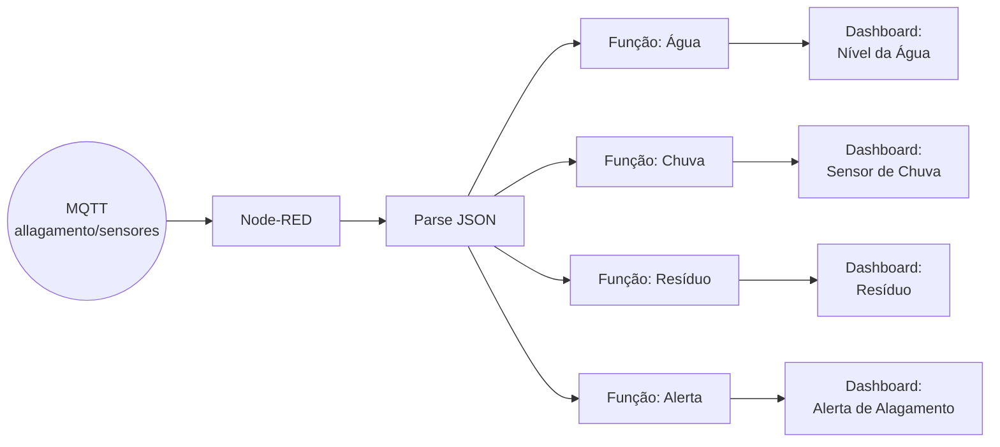

# 🌊 Sistema de Monitoramento de Risco de Alagamento com IoT

## 📌 Descrição do Projeto

Este projeto propõe uma solução de **monitoramento ambiental baseada em IoT** para detectar **níveis de risco de alagamento**. O sistema coleta dados de sensores (água, chuva e resíduo), envia essas informações via MQTT e exibe em tempo real em um **dashboard do Node-RED**. A solução foi validada em ambiente simulado no **Wokwi**.

## 🧠 Objetivo

Oferecer uma ferramenta acessível e escalável para **prevenção de desastres urbanos causados por alagamentos**, permitindo uma **resposta antecipada** com base em dados de sensores.

## 🛠️ Tecnologias Utilizadas

- [Wokwi](https://wokwi.com/) – Simulação de sensores e ESP32
- [ESP32](https://www.espressif.com/en/products/socs/esp32) – Placa de desenvolvimento simulada
- **Sensores simulados**: Nível de água, chuva, resíduos
- [Node-RED](https://nodered.org/) – Plataforma para criação do dashboard e fluxo de dados
- **MQTT** (via broker público HiveMQ) – Protocolo de comunicação
- Dashboard Node-RED – Visualização dos dados em tempo real

## 🔁 Funcionamento do Sistema

1. O ESP32 coleta dados dos sensores (valores analógicos simulados).
2. Os dados são agrupados em um JSON e publicados no tópico MQTT `alagamento/sensores`.
3. O Node-RED escuta esse tópico, trata os dados com um nó `json`, e os distribui:
   - Para três gráficos (água, chuva e resíduo)
   - Para um painel de alerta textual exibindo o risco atual de alagamento

## ⚙️ Execução e Testes

### 1. Executar Simulação no Wokwi

- Acesse o projeto no Wokwi:  
  👉 [Link para simulação Wokwi](https://wokwi.com/projects/432943969413076993)
- Pressione **Play** para simular os dados sendo enviados via MQTT.

### 2. Configurar o Node-RED

- Instale o Node-RED (caso ainda não tenha):
  ```bash
  npm install -g --unsafe-perm node-red
  node-red
  ```
- Abra o Node-RED em `http://localhost:1880`
- Importe o fluxo fornecido no repositório.

### 3. Visualizar Dashboard

- Acesse o dashboard:
  ```
  http://localhost:1880/ui
  ```

Você verá os gráficos de sensores em tempo real e o alerta de risco de alagamento.

## 🖼️ Imagens Ilustrativas

### Dashboard em funcionamento:


### Estrutura dos sensores no Wokwi:


### Fluxo Node-RED:


## 💬 Fluxo de Dados no Node-RED



## 🧪 Exemplo de Payload recebido via MQTT

```json
{
  "residuo": 1827,
  "chuva": 3980,
  "agua": 1628,
  "risco": "ALTO"
}
```

## 📄 Código-Fonte Comentado (Trecho do ESP32)

```cpp
  // Lê valores dos sensores
  int valorAgua = analogRead(34);
  int valorChuva = analogRead(35);
  int valorResiduo = analogRead(32);

  // Calcula risco com base em thresholds simples
  bool alerta = (valorAgua > 2000 || valorChuva > 2000);
  
  const char* risco;
  if (alerta) {
    risco = "ALTO";
  } else {
    risco = "BAIXO";
  }

  // Cria documento JSON dinâmico e envia via MQTT
  DynamicJsonDocument doc(256);
  doc["residuo"] = valorResiduo;
  doc["chuva"] = valorChuva;
  doc["agua"] = valorAgua;
  doc["risco"] = risco;
```

## 🌎 Impacto Ambiental e Social
- ♻️ Contribuição para uma cidade mais limpa e sustentável.  
- 🌧️ Redução de enchentes causadas por descarte irregular.  
- 🏙️ Melhoria na qualidade de vida urbana.  
- 🤝 Facilita a comunicação entre cidadãos e órgãos públicos.
