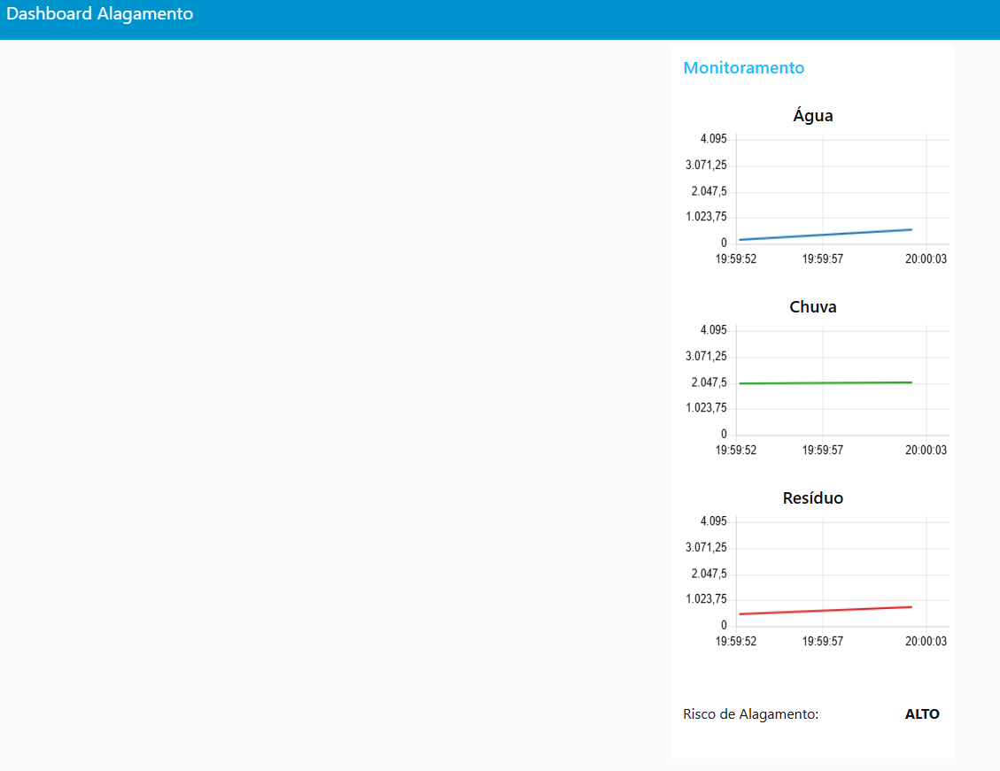
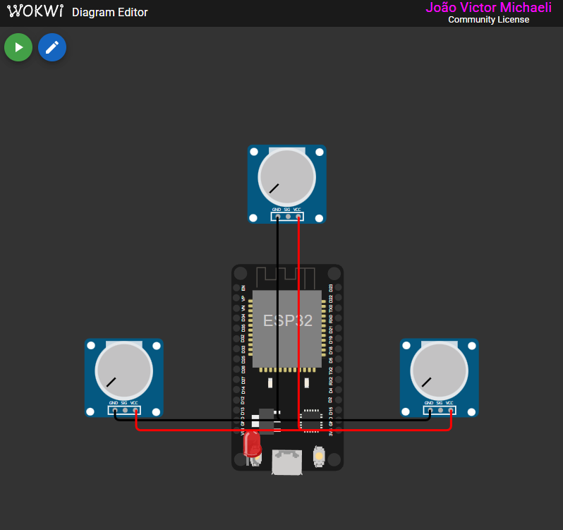
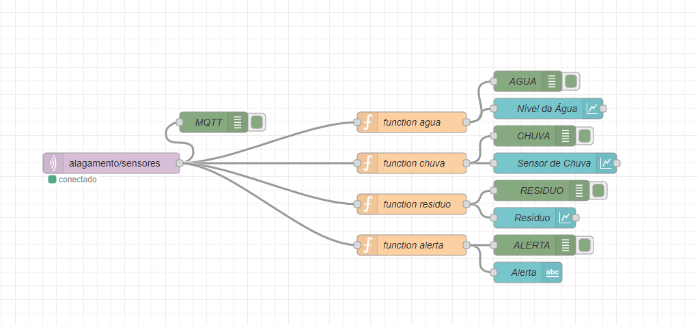
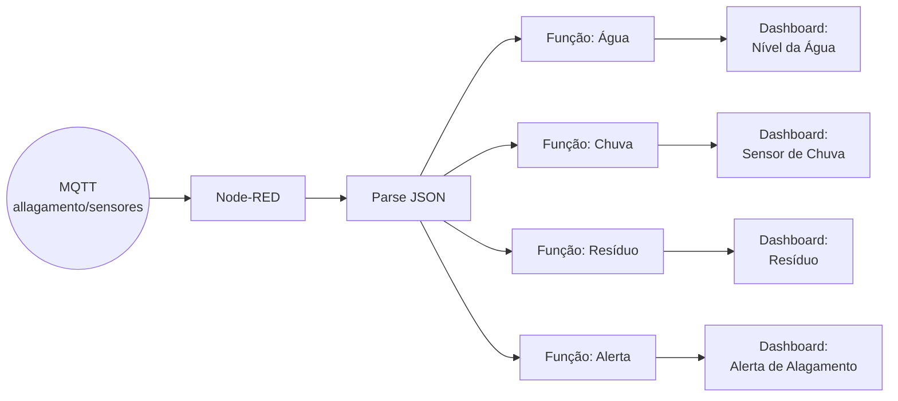

# 🌊 Sistema de Monitoramento de Risco de Alagamento com IoT

## 📌 Descrição do Projeto

Este projeto propõe uma solução de **monitoramento ambiental baseada em IoT** para detectar **níveis de risco de alagamento**. O sistema coleta dados de sensores (água, chuva e resíduo), envia essas informações via MQTT e exibe em tempo real em um **dashboard do Node-RED**. A solução foi validada em ambiente simulado no **Wokwi**.

## 🧠 Objetivo

Oferecer uma ferramenta acessível e escalável para **prevenção de desastres urbanos causados por alagamentos**, permitindo uma **resposta antecipada** com base em dados de sensores.

## 🛠️ Tecnologias Utilizadas

- [Wokwi](https://wokwi.com/) – Simulação de sensores e ESP32
- [ESP32](https://www.espressif.com/en/products/socs/esp32) – Placa de desenvolvimento simulada
- **Sensores simulados**: Nível de água, chuva, resíduos
- [Node-RED](https://nodered.org/) – Plataforma para criação do dashboard e fluxo de dados
- **MQTT** (via broker público HiveMQ) – Protocolo de comunicação
- Dashboard Node-RED – Visualização dos dados em tempo real

### 🛡️ Prevenção Ativa
- Monitoramento contínuo de 3 fatores críticos:
  - Nível d'água
  - Intensidade pluviométrica
  - Acúmulo de resíduos

### 📊 Dashboard Inteligente
- Visualização integrada no Node-RED com:
  - Gráficos temporais
  - Indicador de risco colorido
  - Histórico dos últimos 30 minutos

## 🔁 Funcionamento do Sistema

1. O ESP32 coleta dados dos sensores (valores analógicos simulados).
2. Os dados são agrupados em um JSON e publicados no tópico MQTT `alagamento/sensores`.
3. O Node-RED escuta esse tópico, trata os dados com um nó `json`, e os distribui:
   - Para três gráficos (água, chuva e resíduo)
   - Para um painel de alerta textual exibindo o risco atual de alagamento

## ⚙️ Execução e Testes

### 1. Executar Simulação no Wokwi

- Acesse o projeto no Wokwi:  
  👉 [Link para simulação Wokwi](https://wokwi.com/projects/432943969413076993)
- Pressione **Play** para simular os dados sendo enviados via MQTT.

### 2. Configurar o Node-RED

- Instale o Node-RED (caso ainda não tenha):
  ```bash
  npm install -g --unsafe-perm node-red
  node-red
  ```
- Abra o Node-RED em `http://localhost:1880`
- Importe o fluxo fornecido no repositório.

### 3. Visualizar Dashboard

- Acesse o dashboard:
  ```
  http://localhost:1880/ui
  ```

Você verá os gráficos de sensores em tempo real e o alerta de risco de alagamento.

## 🖼️ Imagens Ilustrativas

### Dashboard em funcionamento:



### Estrutura dos sensores no Wokwi:



### Fluxo Node-RED:



## 💬 Fluxo de Dados no Node-RED



## 🧪 Exemplo de Payload recebido via MQTT

```json
{
  "residuo": 1827,
  "chuva": 3980,
  "agua": 1628,
  "risco": "ALTO"
}
```

## 🧩 Componentes

### 🔌 Hardware
| Componente       | Descrição                          | Pino ESP32 |
|------------------|------------------------------------|------------|
| Sensor de Água   | Mede nível de água (0-4095)        | GPIO34     |
| Sensor de Chuva  | Detecta precipitação pluviométrica | GPIO33     |
| Sensor de Resíduo| Identifica acúmulo de detritos     | GPIO32     |
| LED de Alerta    | Indicador visual de risco          | GPIO25     |

## 📄 Código-Fonte Comentado (Trecho do ESP32)

```cpp
// Bibliotecas necessárias
#include <WiFi.h>          // Para conexão WiFi
#include <PubSubClient.h>  // Para comunicação MQTT
#include <ArduinoJson.h>   // Para manipulação de JSON

// Configurações de rede
const char* ssid = "Wokwi-GUEST";    // SSID da rede WiFi
const char* password = "";           // Senha da rede (vazia para rede aberta)
const char* mqttServer = "broker.hivemq.com";  // Broker MQTT público
const int mqttPort = 1883;                     // Porta padrão MQTT

WiFiClient espClient;                // Cliente WiFi para ESP32
PubSubClient client(espClient);      // Cliente MQTT

// Definição dos pinos
const int pinResiduo = 32;  // Pino do sensor de resíduos
const int pinChuva = 33;    // Pino do sensor de chuva
const int pinAgua = 34;     // Pino do sensor de nível de água
const int pinAlerta = 25;   // Pino do LED de alerta

// Limiares dos sensores (valores analógicos 0-4095)
const int limiteResiduo = 2000;  // Limite para detecção de resíduos
const int limiteChuva = 2000;    // Limite para detecção de chuva intensa
const int limiteAgua = 2000;     // Limite para detecção de nível alto de água

/*
 * Função: setup_wifi
 * ------------------
 * Estabelece conexão com a rede WiFi e exibe status no monitor serial
 */
void setup_wifi() {
  Serial.begin(115200);  // Inicia comunicação serial
  Serial.print("Conectando ao WiFi...");
  WiFi.begin(ssid, password);  // Inicia conexão WiFi
  
  // Aguarda até que a conexão seja estabelecida
  while (WiFi.status() != WL_CONNECTED) {
    delay(500);
    Serial.print(".");
  }
  Serial.println("\nWiFi conectado!");  // Confirmação de conexão
}

/*
 * Função: reconnect
 * -----------------
 * Gerenciamento de reconexão com o broker MQTT
 */
void reconnect() {
  // Tenta reconectar até obter sucesso
  while (!client.connected()) {
    Serial.print("Conectando MQTT...");
    
    // Tenta conexão com ID único
    if (client.connect("ESP32Client_Alagamento")) {
      Serial.println("Conectado!");
    } else {
      // Exibe motivo da falha e tenta novamente após 5 segundos
      Serial.print("Falha, rc=");
      Serial.print(client.state());
      Serial.println(" Tentando novamente em 5s...");
      delay(5000);
    }
  }
}

/*
 * Função: setup
 * -------------
 * Configuração inicial do sistema
 */
void setup() {
  pinMode(pinAlerta, OUTPUT);  // Configura pino do LED como saída
  setup_wifi();                // Conecta ao WiFi
  client.setServer(mqttServer, mqttPort);  // Configura servidor MQTT
}

/*
 * Função: loop
 * ------------
 * Loop principal do programa, executado continuamente
 */
void loop() {
  // Verifica e mantém conexão MQTT
  if (!client.connected()) {
    reconnect();
  }
  client.loop();  // Mantém a conexão MQTT ativa

  // Leitura dos sensores analógicos
  int leituraResiduo = analogRead(pinResiduo);
  int leituraChuva = analogRead(pinChuva);
  int leituraAgua = analogRead(pinAgua);

  // Determina se há situação de risco
  bool alerta = (leituraResiduo > limiteResiduo || 
                leituraChuva > limiteChuva || 
                leituraAgua > limiteAgua);
  
  // Define o nível de risco e aciona o alerta visual
  const char* risco;
  if (alerta) {
    risco = "ALTO";
    digitalWrite(pinAlerta, HIGH);  // Aciona LED
  } else {
    risco = "BAIXO";
    digitalWrite(pinAlerta, LOW);   // Desliga LED
  }

  // Cria documento JSON com os dados dos sensores
  DynamicJsonDocument doc(256);
  doc["residuo"] = leituraResiduo;
  doc["chuva"] = leituraChuva;
  doc["agua"] = leituraAgua;
  doc["risco"] = risco;

  // Serializa JSON para envio
  char payload[256];
  size_t n = serializeJson(doc, payload);
  
  // Exibe no monitor serial para debug
  Serial.print("JSON enviado: ");
  Serial.println(payload);

  // Publica no tópico MQTT
  if (client.publish("alagamento/sensores", payload)) {
    Serial.println("Publicado com sucesso!");
  } else {
    Serial.println("Falha ao publicar!");
  }

  delay(10000);  // Intervalo entre leituras (10 segundos)
}
```

## 🌎 Impacto Ambiental e Social
- ♻️ Contribuição para uma cidade mais limpa e sustentável.  
- 🌧️ Redução de enchentes causadas por descarte irregular.  
- 🏙️ Melhoria na qualidade de vida urbana.  
- 🤝 Facilita a comunicação entre cidadãos e órgãos públicos.
